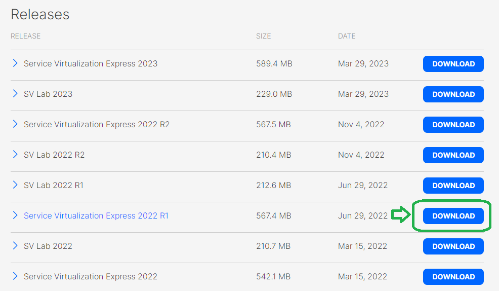

# How to download & install the SV Designer

Please, follow the steps below to install the free version of the SV Designer.

## Downloading SV Designer 2022 Installer

Use the following link to download the SV Designer Express Edition Installer:

<https://marketplace.microfocus.com/appdelivery/content/service-virtualization>

The Express Edition is free and supports the full functionality, just its performance is limited to 10 Tps, and you can work at maximum with only 3 virtual services at a time (if you work locally on the Embedded Server).

_You have to create an account first in the Micro Focus Marketplace, providing just some very basic info.
Then you can download the installer exe. Please scroll down in the Marketplace portal to see the
"**Service Virtualization Express 2022**" download button. You can also download any later version, if available._

## SV Designer Express Edition Installation

### STEP 1

After you have downloaded **SV\_Designer\_2022\_Installer.exe**, please run it and start the installation.

### STEP 2

Before the installation starts, you may be requested to install the *.NET 4.8* and 
the *Microsoft Visual C++ Redistributable Package(s)*. 
Please allow installation of these components.

You may be asked to reboot, but besides .NET 4.8, you can click *Continue*, and only reboot once at the end of the installation.

### STEP 3

Click Next.

### STEP 4

Agree with the License Agreement and click Next.

### STEP 5

Click Next.

### STEP 6

Make sure the **Embedded** Database Type is selected and click Next.

### STEP 7

Click Next.

### STEP 8

Please do select the **“Generate new self-signed certificate”** option and click Next.

**STEP 9**

Click Install.

**STEP 10**

After the installation has finished, click Finish, then click Exit in the initial installer screen from Step 1.

**STEP 11**

Please run the SV Designer to make sure it was installed properly and you can use it. 
You will be requested to optionally provide a password to encrypt your SV Designer projects. 
For now you can leave the Password field empty and click OK (you specify the password later, if needed).

The SV Designer should load. You are ready to start using it.

