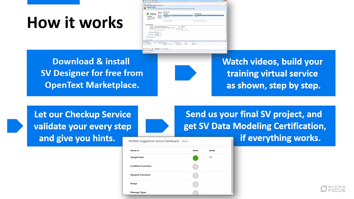

# Service Virtualization Data Modeling Training

Welcome to the home page of the ultimate SV self-paced data modeling training. 

## How to begin
1) Download and install the SV Designer 2022 (or later) as described step by step in the [install guide](/Install%20SV%20Designer.md).
2) Download PDF with [Hands-On Instructions](https://github.com/MicroFocus/sv-trainings/raw/main/Resources/SV%20Training%20-%20Hands%20On%202022.pdf) to follow.
3) Download [training resources and sample messages](https://github.com/MicroFocus/sv-trainings/raw/main/Resources/Training.zip).
4) Start watching the videos below, beginning with the first one.
5) You will also need a REST API client to invoke services. Use your favorite one, or [search the web and install one](https://www.google.com/search?q=rest+api+client).

## Training YouTube playlist
You can use the following [YouTube playlist](https://www.youtube.com/playlist?list=PLLkt3dLab1_Wu_Q_IatdF5fmE80vYsCAl).

## Part 1 - SV Designer and training setup 

#### Content:
- Setting up the training
- SV Designer as a client to manage SV Servers
- SV Agents

## Part 2 - Your first Virtual Service 

#### Content:
- Training "cover story" (the troubles you will learn to fix)
- Creating and testing your first empty virtual service (from scratch)

## Part 3 - Setting up basic behavior

#### Content:
- Purpose of Data and Performance models
- Operations
- Default Response
- Importing sample messages
- Data Model Accuracy

## Part 4 - Request Matching and basic troubleshooting

#### Content:
- How to check your progress automatically
- Importing and exporting SV Agents
- SV Solution with multiple SV Projects
- Request Matching
- Basic troubleshooting using the Message Log and the Simulation Report

## Part 5 - Customizing Request Matching conditions

#### Content:
- Is and Ignore Condition Functions
- Custom Condition Functions

## Part 6 - Dynamic response value generation basics

#### Content:
- Splitting business logic into rules
- Copying values from request to response
- Using Sequence Generators and value generators in general

## Part 7 - Arrays, Rule priority, advanced value generation

#### Content:
- How rules play together based on their priority
- Special functions for dynamic array generation (Array Template, Replace Array)
- Random value generators
- Array matching basics

## Part 8 - Recording real service, Message Types, Simulation Report

#### Content:
- Virtual Service Modes
- Specifying Virtual Service URL
- Recording Real Service
- Message Types
- Exporting Messages
- Advanced troubleshooting of value generation using the Simulation Report

## Part 9 - Data Masking, statefulness, export, undeploy

#### Content:
- Exporting project
- Project files on your file system
- Undeploying services
- Endpoint conflicts
- Data Masking
- SV Tracks for Stateful Simulation

## Part 10 - Service Call Activities

#### Content:
- Calling external services in simulation
- For HTTP Async call see also this [video](https://youtu.be/45iNyM5EkE0).

## Part 11 - Scripting in C# and JavaScript

#### Content:
- Creating C# and JavaScript rules
- Changing selected data model fields via script
- Debugging and troubleshooting (including from Visual Studio)
- Read more on [log file location](https://admhelp.microfocus.com/sv/en/2022-2022-r1/Help/Content/UG/c_logs.htm).
- Read more on [turning off the security mode](https://admhelp.microfocus.com/sv/en/2022-2022-r1/Help/Content/UG/t_scripted_rule_Csharp.htm#mt-item-1).
- Read more on [using third-party components in C#](https://admhelp.microfocus.com/sv/en/2022-2022-r1/Help/Content/UG/t_Csharp_thirdpartylib.htm).
- Read more on [keeping an internal state in the Context dictionary objects](https://admhelp.microfocus.com/sv/en/2022-2022-r1/Help/Content/UG/t_scripted_rule.htm#mt-item-2).

## Part 12 - Combining real and simulated traffic

#### Content:
- Frequent use cases
- Hybrid simulation explained
- Final check of your Virtual Service
- How to get certified
